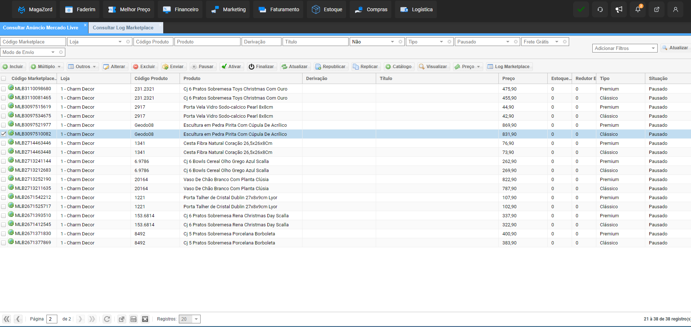

# Teste para vaga de Analista de Qualidade no Magazord.com.br
Este repositório tem como fim testar os candidatos para vaga de analista de qualidade na empresa [Magazord](https://magazord.com.br).

# 1º Cenário:

Você está trabalhando como Analista de Qualidade em um projeto de integração de marketplaces de terceiros, como Amazon e Mercado Livre, em um grande e-commerce. A equipe de desenvolvimento concluiu a implementação da integração e você é responsável por realizar os testes para garantir que a funcionalidade esteja funcionando corretamente.
Um detalhe importante, nessa integração, temos integração de estoque, anúncios, faturamento, pedidos e preço.

## Sua tarefa:

Descrever detalhadamente o plano de testes que você implementaria para validar a integração com o marketplace. Inclua no seu plano:

**1. Documentação e Materiais de Apoio:**
  _ **Identificação da documentação:** Quais documentos e materiais de apoio serão utilizados para embasar o plano de testes? (Ex.: documentação oficial dos marketplaces, especificações técnicas da integração, requisitos do projeto, etc.)
  _ **Análise da documentação:** Como você analisará a documentação para identificar os pontos de teste?
  _ **Mapeamento dos requisitos:** Como você mapeará os requisitos da integração aos pontos de teste?
  _ **Utilização de ferramentas:** Quais ferramentas serão utilizadas para auxiliar na análise da documentação e no mapeamento dos requisitos? (Ex.: ferramentas de gerenciamento de requisitos, ferramentas de análise de texto, etc.)
**2. Abrangência dos Testes:**
  _ **Funcionalidades:** Quais funcionalidades da integração serão testadas?
  _ **Casos de uso:** Quais casos de uso serão considerados para cada funcionalidade? (Ex.: cenários de sucesso, cenários de falha, cenários de carga, etc.)
  _ **Priorização dos testes:** Quais critérios serão utilizados para priorizar os testes? (Ex.: criticidade da funcionalidade, impacto no negócio, riscos potenciais, etc.)
**3. Execução dos Testes:**
  _ **Ambiente de teste:** Qual ambiente de teste será utilizado? (Ex.: ambiente de homologação, ambiente de produção, etc.)
  _ **Dados de teste:** Como você obterá os dados de teste necessparios para os testes? (Ex.: dados de produtos, dados de pedidos, dados de usuários, etc.)
  _ **Ferramentas de automação:** Quais ferramentas de automação serão utilizadas para executar os testes? (Ex.: ferramentas de teste funcional, ferramentas de teste de API, etc.)
  _ **Registro de resultados:** Como você registrará os resultados dos testes? (Ex.: ferramenta de gerenciamento de testes, planilhas eletrônicas, etc.)

# 2º Cenário:

Você está trabalhando como Analista de Qualidade em um projeto de integração com a ferramenta de gerenciamento de estoque Bling em um grande e-commerce. A equipe de desenvolvimento concluiu a implementação da integração e você é responsável por realizar os testes para garantir que a funcionalidade esteja funcionando corretamente.

## Sua tarefa:

Descrever detalhadamente o plano de testes que você implementaria para validar a integração com a ferramenta Bling. Inclua no seu plano:

**1. Documentação e Materiais de Apoio:**
  _ **Identificação da documentação:** Quais documentos e materiais de apoio serão utilizados para embasar o plano de testes? (Ex: documentação oficial da Bling, especificações técnicas da integração, requisitos do projeto, etc.)
  _ **Mapeamento dos requisitos:** Como você mapeará os requisitos da integração aos pontos de teste?
  _ **Utilização de ferramentas:** Quais ferramentas serão utilizadas para auxiliar na análise da documentação e no mapeamento dos requisitos? (Ex: ferramentas de gerenciamento de requisitos, ferramentas de análise de texto, etc.)
**2. Abrangência dos Testes:**
  _ **Funcionalidades:** Quais funcionalidades da integração com a Bling serão testadas? (Ex: sincronização de produtos, atualização de estoque, processamento de pedidos, geração de relatórios, etc.)
  _ **Priorização dos testes:** Quais critérios serão utilizados para priorizar os testes? (Ex: criticidade da funcionalidade, impacto no negócio, riscos potenciais, etc.)
**3. Execução dos Testes:**
  _ **Dados de teste:** Como você obterá os dados de teste necessários para os testes? (Ex: dados de produtos, dados de estoque, dados de pedidos, etc.)
  _ **Ferramentas de automação:** Quais ferramentas de automação serão utilizadas para executar os testes? (Ex: ferramentas de teste funcional, ferramentas de teste de API, etc.)
  _ **Registro de resultados:** Como você registrará os resultados dos testes? (Ex: ferramenta de gerenciamento de testes, planilhas eletrônicas, etc.)

# 3º Cenário:

O cliente entrou em contato devido a uma questão relacionada aos seus anúncios. Quando os itens ficam sem estoque, em vez de serem marcados como "Pausado (sem estoque)", eles estão apenas sendo marcados como "Pausado", o que faz com que os anúncios permaneçam disponíveis para venda no Mercado Livre, mesmo sem estoque real. Isso está resultando em pedidos sendo feitos para itens sem estoque disponível, o que prejudica a reputação do cliente, pois ele precisa cancelar as vendas devido à falta de estoque.

Atualmente, o cliente possui 38 anúncios com a situação "Pausado", e ele relata que não os marcou manualmente como pausados.Quando enviamos uma atualização manual de estoque, o anúncio muda para a situação "Pausado sem estoque" e fica indisponível para venda no Mercado Livre.
Ao verificar o log dos anúncios, não encontramos registros de envio de informação de estoque igual a zero quando o estoque se esgota no Magazord.
Um exemplo de anúncio afetado é o seguinte: [MLB3097510082](https://produto.mercadolivre.com.br/MLB-3097510082-escultura-em-pedra-pirita-com-cupula-de-acrilico-_JM).
Envio em anexo um print do anúncio e um print do log, mostrando que não foram encontradas informações registradas na abertura da atividade.

Para o caso acima, descreva quais seriam os passos para analise e identificação do problema tendo em vista a documentação do próprio ML. Visto que não possui acesso ao painel seller do cliente e nem ao painel do mesmo no ERP Magazord, quais seriam as possíveis hipóteses do erro.

